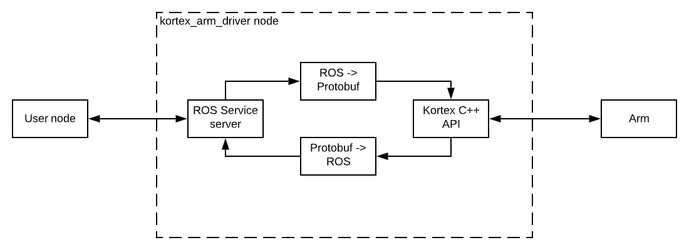
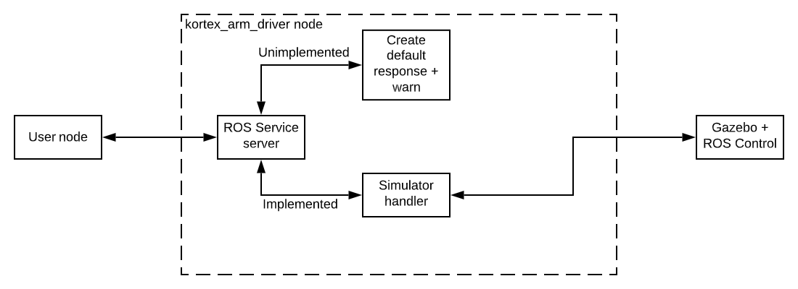

<!-- 
* KINOVA (R) KORTEX (TM)
*
* Copyright (c) 2018 Kinova inc. All rights reserved.
*
* This software may be modified and distributed 
* under the terms of the BSD 3-Clause license. 
*
* Refer to the LICENSE file for details.
*
* -->

# Kortex Examples

<!-- MarkdownTOC -->

1. [Before running an example](#first_of_all)
2. [Understanding the ways to use a Kortex arm with ROS](#the_ways)
3. [Actuator configuration examples](#actuator_config)
4. [Full arm movement examples](#full_arm)
5. [Vision module configuration examples](#vision_config)
6. [MoveIt! examples](#move_it)

<!-- /MarkdownTOC -->

## Before running an example

Before you run any example, make sure :
- You have already built the packages using `catkin_make`.
- You are physically connected to an arm (or you are connected over Wi-Fi) and you have started the `kortex_driver` node by following the [instructions](../kortex_driver/readme.md), or you have started the arm in simulation following the [instructions](../kortex_gazebo/readme.md).
- The node started correctly and without errors.

## The ways to use a Kortex arm with ROS

There are a couple ways to use a Kortex arm with ROS, may it be in simulation or with a real arm.

1. Using the auto-generated services and topics

    The driver auto-generates ROS services based on the C++ Kortex API, so every API call has its ROS equivalent. Some topics (not  auto-generated) are also offered for convenience. You can read more about services, topics and notifications [here](../kortex_driver/readme.md#services).

    **With a real arm**, the auto-generated wrapper translates ROS requests to Kortex API requests (Protobuf), and translated responses back to ROS structures.

    

    **In simulation**, the same services and topics are advertised by the kortex_driver node, but instead of translating to Kortex API and forwarding to an arm, the message either goes through on our own simulator (if the handler for the given service is implemented) or a default response is sent back and a warning printed.

    

    Only a couple "core" services handlers have been implemented in simulation (mostly the ones that make the robot move and stop), namely:
    - PlayJointTrajectory and the REACH_JOINT_ANGLES action type (to reach an angular goal)
    - PlayCartesianTrajectory and the REACH_POSE action type (to reach a Cartesian goal)
    - SendGripperCommand and the SEND_GRIPPER_COMMAND action type (to actuate the gripper)
    - SendJointSpeedsCommand (for joint velocity control)
    - ApplyEmergencyStop and Stop (to stop the robot)
    - The Actions interface (ExecuteAction, ExecuteActionFromReference, CreateAction, DeleteAction, UpdateAction, StopAction).

    It is also important to note that IK solutions for real arms and simulated arms may vary, as KDL is used in simulation and our own kinematics library is used in the arm's firmware.  

    The simulated SendTwistCommand service has a POC implementation, we decided it is not stable enough to be activated by default. You can uncomment the kortex_arm_driver.cpp simulation handler to re-enable it and try it yourself. The same goes for the Cartesian velocity topic.

    There is no plan to add more simulated services for now, but any user can write his own implementation of a Kortex ROS Service and enable the handler for it (let's say you want to simulate an Interconnect Expansion GPIO device, or a Vision device). The kortex_arm_driver.cpp file should provide all guidelines as to how to define your handler, and you are welcome to open an issue if you want more information on simulation handlers.

2. Using MoveIt

    The kortex_driver offers a FollowJointTrajectory Action Server and a GripperCommand Action Server (when a gripper is used) and the MoveIt configuration files are stored for all configurations in kortex_move_it_config. This enables users to use the MoveIt Commander, or the MoveIt Python or C++ interfaces to control the arm with the motion planning framework.

    

    **With a real arm**, the FollowJointTrajectory Action Server uses the Kortex API `PlayPreComputedJointTrajectory`. This call expects a full joint trajectory interpolated at a 1ms timestep, because the arm takes the trajectory as is, verifies it respects all velocity and acceleration constraints and then executes it as a low-level trajectory. Because of this timestep constraint, the MoveIt OMPL planning pipeline has an additional step which uses the `industrial_trajectory_filters/UniformSampleFilter` to interpolate the MoveIt output with a 1ms-timestep. Any timestep that provides a wrong velocity or acceleration causes the whole trajectory to be rejected. The velocity and acceleration limits in the configuration files have been tuned so no trajectory should yield such values, but if you experience trajectory rejection problems, you can tune down those parameters.

    **In simulation**, the FollowJointTrajectory and GripperCommand Action Servers are the ones spawned by the ros_controllers used with Gazebo. They don't need 1ms-timestep, but no option was added in MoveIt to switch between simulated or real action servers, so the same interpolator is used in simulation although it is not required. The Gen3 Intel Realsense camera is not simulated.

3. Low-level control

    **With a real arm**, the low-level control functions have not been added to the Kortex API wrapper because the arm absolutely needs 1kHz control, otherwise it jerks. As ROS is not really real-time friendly, we chose not to offer those functions.

    **In simulation**, the ros_controllers used with Gazebo can be directly controlled with their associated topics if you prefer controlling the joints directly without using the simulation handlers, but be aware that this interface is not accessible with the real arm! The code you write that way will need to be changed significantly to be used with a real arm.

## Actuator configuration examples
*Examples to show how to use actuator_config ROS services to configure a given actuator.*

The examples look for advertised services in the **my_gen3** namespace by default and configures the first actuator.

To run the C++ example: `roslaunch kortex_examples actuator_config_cpp.launch`

To run the Python example: `roslaunch kortex_examples actuator_config_python.launch`

If you started the `kortex_driver` node in another namespace (not **my_gen3**) or if you want to test the example on another actuator than the first one, you will have to supply node parameters in the command line (the syntax doesn't change if you run the C++ or Python example): 

`roslaunch kortex_examples actuator_config_cpp.launch robot_name:=<your_robot_name> device_id:=<your_device_id>`

## Full arm examples
*Examples to show how to use the base ROS services to move and configure the arm.*

The examples look for advertised services in the **my_gen3** namespace by default.

- **Simple movement example**:

    - To run the C++ example: `roslaunch kortex_examples full_arm_movement_cpp.launch`
    - To run the Python example: `roslaunch kortex_examples full_arm_movement_python.launch`
    
    If you started the `kortex_driver` node in another namespace (not **my_gen3**), you will have to supply the node a parameter in the command line (the syntax doesn't change if you run the C++ or Python example) : 
    
    `roslaunch kortex_examples full_arm_movement_cpp.launch robot_name:=<your_robot_name>`

- **Cartesian poses with notifications**:

    - To run the C++ example: `roslaunch kortex_examples cartesian_poses_with_notifications_cpp.launch`
    - To run the Python example: `roslaunch kortex_examples cartesian_poses_with_notifications_python.launch`
    
    If you started the `kortex_driver` node in another namespace (not **my_gen3**), you will have to supply the node a parameter in the command line (the syntax doesn't change if you run the C++ or Python example) : 
    
    `roslaunch kortex_examples cartesian_poses_with_notifications_cpp.launch robot_name:=<your_robot_name>`

## Vision module configuration examples
*Examples to show how to use the vision_config ROS services to configure the vision module.*

The examples look for advertised services in the **my_gen3** namespace by default.

To run the C++ example: `roslaunch kortex_examples vision_configuration_cpp.launch`

To run the Python example: `roslaunch kortex_examples vision_configuration_python.launch`

If you started the `kortex_driver` node in another namespace (not **my_gen3**), you will have to supply the node a parameter in the command line (the syntax doesn't change if you run the C++ or Python example) : 

`roslaunch kortex_examples vision_configuration_cpp.launch robot_name:=<your_robot_name>`

## MoveIt! example
*Example to show how to use the Python MoveIt! API to move the arm.*

The example looks for advertised services and topics in the **my_gen3** namespace by default.

To run the example: `roslaunch kortex_examples moveit_example.launch`

If you started the `kortex_driver` node in a non-default namespace (not **my_gen3**), you will have to supply the node your own namespace in the command line : 

`roslaunch kortex_examples moveit_example.launch robot_name:=<your_own_namespace>`
